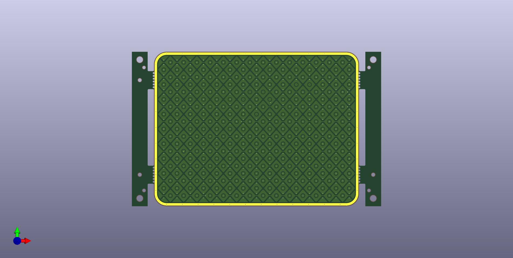
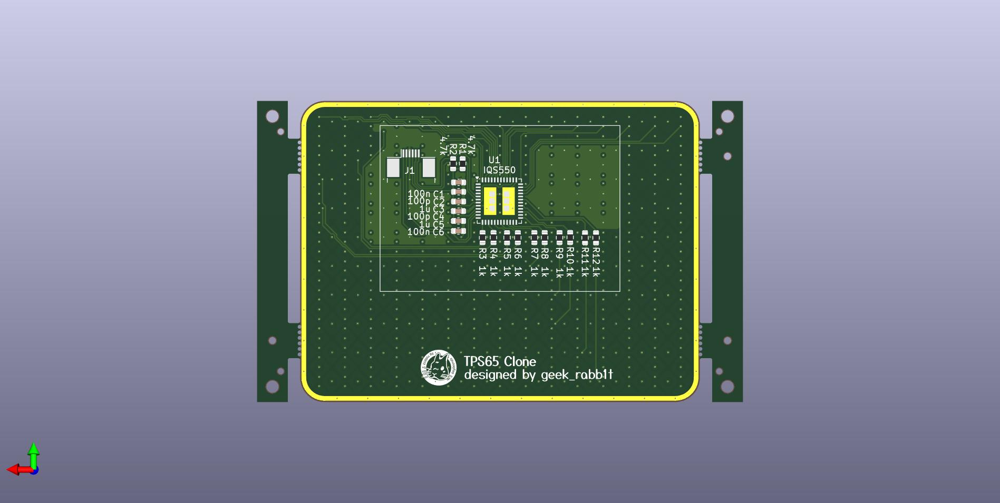

# GR-Trackpad65

Trackpad module designed for a keyboard named Futaba.

Azoteq's TPS65 trackpad module has been discontinued, so I designed a trackpad to achieve the same size.

The controller IC is the IQS550, which is also used in the TPS65.  
Therefore, modules designed to use the TPS65 may be used without modification.

There is no compatibility in the settings to be written to the IQS550, just the same module size and pin assignments.

## Overview

### Appearance

| Top side | Bottom side |
|---|---|
|||

### Dimensions

|  | Length | Width |
|---| --- | ---|
| Trackpad only |49mm | 65mm |
| with sacrificed plate |49mm |79mm |

### Pin assign

Pin assignments for FFC connectors.
From left to right.

| No. |  |
|---| --- |
| 1 | RDY |
| 2 | NRST |
| 3 | GND |
| 4 | VCC |
| 5 | SCL |
| 6 | SDA |

## PCB Specifications

No special settings are required, but if manufactured on a PCB other than 1.6 mm thick, it may not work well.

| 項目 | Value | note |
| --- | --- | --- |
| Layers | 4 |  |
| PCB Thickness | 1.6mm |  |
| Tooling holes | Added by Customer | Option for PCBA. (Only JLCPCB) |

### Bill of Materials

The parts required for manufacturing are listed below.

| Part Detail | Reference | Quantity | Note |
| --- | --- | --- | --- |
| Azoteq IQS550BLQNR | U1 | 1 | Controller IC |
| JUSHUO AFC07-S06FCC-00  | J1 | 1 | FFC connector |
| Capacitor(100nF) | C1,C6 | 2 | 0603 Package |
| Capacitor(100pF) | C2,C4 | 2 | 0603 Package |
| Capacitor(1uF) | C3,C5 | 2 | 0603 Package |
| Resistor(4.7kΩ) | R1,R2 | 2 | 0603 Package |
| Resistor(1kΩ) | R3 - R12 | 10 | 0603 Package |

## Surface material of trackpad

Be sure to attach some kind of material to the surface of the trackpad.  
If you use the trackpad without attaching any material, it will not work properly.

The recommended material is 2mm thick matte acrylic. 
If other materials are used, adjust the setting value according to the environment.

## Writing configuration

**It does not function as a trackpad when just manufactured.
It is necessary to write the configuration to the controller IC.**

The trackpad configuration is located in `config` directory.

| File name | Description |
| --- | --- |
| gr-trackpad65.ini | Trackpad configuration file to be set temporarily from the debug tool. |
| gr-trackpad65_Vx.x.hex  | Pre-configured firmware. Normally use this one. |

To write the configuration, you will need Azoteq's CT210A writing tool.

- https://mou.sr/3Z9SMgG
- 

Special software is required to write configuration and debug the trackpad.
These can be downloaded from Azoteq's website.

https://www.azoteq.com/design/software-and-tools/

- IQS5XX B000 GUI  
Use this to debug the trackpad and write configuration.
- IQS5XX Flash Programmer  
This can also be used if you only want to write preconfigured binaries.

The usage of the tool and specifications of the controller IC are documented on Azoteq's website.
Please refer to these documents for setting up.

- [IQS550/572/525-B000 DATASHEET](https://www.azoteq.com/images/stories/pdf/iqs5xx-b000_trackpad_datasheet.pdf)
- [AZD087 - Setup and user guide for the IQS5XX-B000 series](https://www.azoteq.com/images/stories/pdf/AZD087%20-%20IQS5xx-B000%20Setup%20and%20User%20Guide.pdf)

Various other documents can be accessed from this page and referred to as necessary.

https://www.azoteq.com/design/application-notes/

---

# GR-Trackpad65

Futabaというキーボード用に設計したトラックパッドモジュールです。

Azoteq社の TPS65 というトラックパッドモジュールが製造中止になってしまったので、  
同じサイズのトラックパッドを実現するために設計しました。

コントローラーICには、TPS65 でも使用している IQS550 を採用しています。  
そのため、TPS65 を使用するように設計されたモジュールでもそのまま使用できる可能性があります。

モジュールサイズやピンアサインが同じだけで、IQS550に書き込む設定に互換性はありません。

## モジュール概要

### 外観

| 表 | 裏 |
|---|---|
|||

### サイズ

|  | 縦 | 横 |
|---| --- | ---|
| トラックパッド本体 |49mm | 65mm |
| PCBA用の捨て板付き |49mm |79mm |

### ピンアサイン

FFCコネクタのピンアサイン。  
左から順に。

| No. |  |
|---| --- |
| 1 | RDY |
| 2 | NRST |
| 3 | GND |
| 4 | VCC |
| 5 | SCL |
| 6 | SDA |

## 製造データ

特に特別な設定は必要ありませんが、1.6mm厚以外のPCBで製造した場合、上手く動かない可能性があります。

| 項目 | 値 | メモ |
| --- | --- | --- |
| 層数 | 4層PCB |  |
| PCB の厚さ | 1.6mm厚 |  |
| Tooling holes | Added by Customer | PCBAの設定項目 (JLCPCBに発注する場合) |

### 必要なパーツリスト

発注時に以下のパーツを指定して、PCBAを依頼してください。  
JLCPCBに発注する場合は、ガーバーファイルに必要な情報が含まれています。  
他のベンダーに依頼する場合や、パーツが不明な場合は以下のパーツを指定してください。  

| パーツ | 使用箇所 | 必要数(1枚当たり) | メモ |
| --- | --- | --- | --- |
| Azoteq IQS550BLQNR | U1 | 1 | コントローラーIC |
| JUSHUO AFC07-S06FCC-00  | J1 | 1 | FFCコネクタ |
| キャパシタ(100nF) | C1,C6 | 2 | 0603サイズ |
| キャパシタ(100pF) | C2,C4 | 2 | 0603サイズ |
| キャパシタ(1uF) | C3,C5 | 2 | 0603サイズ |
| 抵抗(4.7kΩ) | R1,R2 | 2 | 0603サイズ |
| 抵抗(1kΩ) | R3 - R12 | 10 | 0603サイズ |

## トラックパッドの表面素材について

トラックパッドの表面には、必ず何らかの素材を貼り付けて下さい。  
何も貼り付けずに使用すると正しく動作しません。

推奨は2mm厚のマットアクリルです。他の素材使う場合は、環境に合わせて設定値をを調整してください。

## 設定値について

**製造しただけの状態では、トラックパッドとして機能しません。
コントローラーICに設定値を書き込む必要があります。**

標準的な設定は、 `config` ディレクトリに置いてあります。

| ファイル | 用途 |
| --- | --- |
| gr-trackpad65.ini | デバッグツールから一時的に設定するトラックパッドの設定ファイル。 |
| gr-trackpad65_Vx.x.hex  | 設定済みのファームウェア。通常はこちらを使用してください。 |

設定値の書き込みには Azoteq社のCT210A という書き込みツールが必要です。
MouserやDigiKeyで7000円くらいで調達できます。

- https://mou.sr/4i2krZd
- https://www.digikey.jp/short/39892pvp

設定の書き込みやトラックパッドのデバッグには専用のソフトウェアが必要となります。
これらはAzoteq社のホームページからダウンロード可能です。

https://www.azoteq.com/design/software-and-tools/

- IQS5XX B000 GUI  
トラックパッドのデバッグや設定の書き込みにはこちらを使用します。
- IQS5XX Flash Programmer  
設定済みのバイナリの書き込みだけの場合はこちらも使用可能です。

ツールの使い方やコントローラーICの仕様はAzoteq社のホームページ上にドキュメントがあります。
これらを参考に設定してください。

- [IQS550/572/525-B000 DATASHEET](https://www.azoteq.com/images/stories/pdf/iqs5xx-b000_trackpad_datasheet.pdf)
- [AZD087 - Setup and user guide for the IQS5XX-B000 series](https://www.azoteq.com/images/stories/pdf/AZD087%20-%20IQS5xx-B000%20Setup%20and%20User%20Guide.pdf)

その他、こちらのページから様々なドキュメントにアクセスできますので必要に応じて参照してください。

https://www.azoteq.com/design/application-notes/